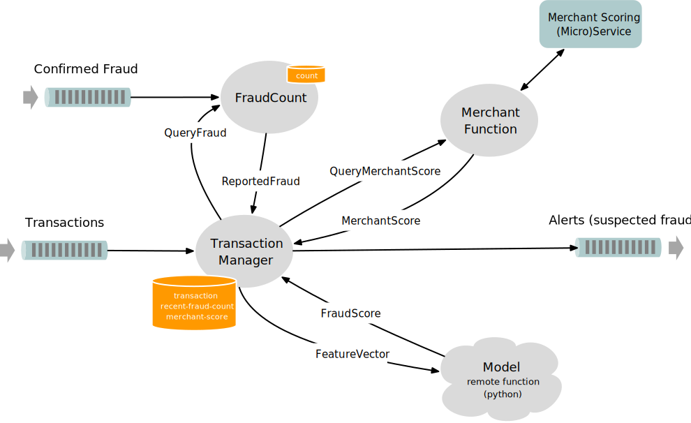

# Flink Stateful Functions Workshop 

## Setup Instructions

The following instructions guide you through the process of setting up a development environment for the purpose of developing,
debugging, and executing solutions for the workshop.

### Software Requirements

This workshop includes embedded stateful functions written in Java,
and a remote function implemented in Python.

The following software is required for building and running the code for this workshop:

* a JDK for Java 8 or Java 11 (a JRE is not sufficient; other versions of Java are not supported)
* Apache Maven 3.x
* Git
* Docker

You will a text editor for making (minor) modifications to the the Python code.

An IDE for Java development (such as IntelliJ) will be useful if you want to be able to modify the parts of this
workshop that are implemented in Java, but this isn't necessary for doing the exercise described below.

### Clone and Build the Software

```bash
$ git clone https://github.com/ververica/flink-statefun-workshop.git
$ cd flink-statefun-workshop 
$ mvn install
$ docker-compose build
```

If you haven’t done this before, at this point you’ll end up downloading all of the dependencies for this Flink project and the base docker image.
This usually takes a few minutes, depending on the speed of your internet connection.

### Get it Running

```bash
$ docker-compose up
```

This should produce a lot of output, but after a minute or so you should start to see messages like this,
interspersed with occasional messages about checkpointing:

```
worker_1  | 2020-08-10 15:03:53,235 INFO  ...  - Suspected Fraud for account id 0x00DD98B2 at Peakhub
worker_1  | 2020-08-10 15:04:29,997 INFO  ...  - Suspected Fraud for account id 0x00F0AEFA at Overgram
```

## Architecture



